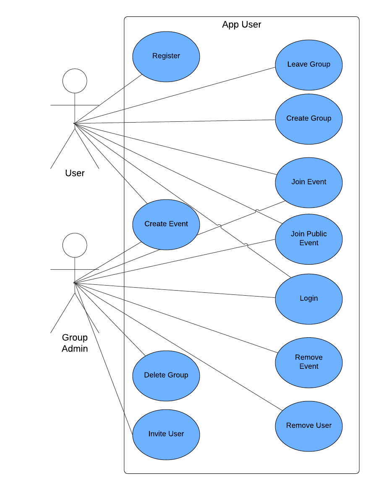
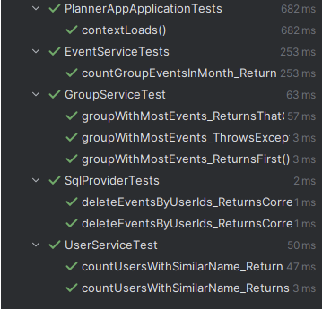
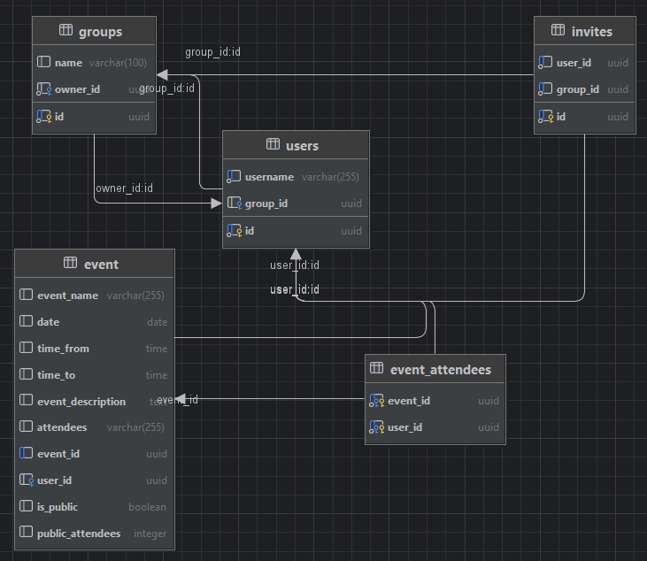

# Calendar Event Sharing App

## Introduction
Welcome to the Calendar Event Sharing App! This application provides a simple, minimalistic interface for managing and sharing calendar events. Users can easily create, view, and share events with others, ensuring seamless organization and communication.

## Installation

To test the project locally on your machine, you can use emulators such as Android Studio or the iOS emulator (available only on macOS). Alternatively, you can use the Expo Go app on your mobile device.

## Prerequisites

Ensure you have the following prerequisites installed:

- [Node.js](https://nodejs.org/) (v20.11.1)
- [npm](https://www.npmjs.com/) (v10.7.0)

## Steps to Install:

1. Clone this repository:
   ```sh
   git clone https://github.com/Lukroza/Planner-App.git

2. Navigate to the project directory:
    ```sh
    cd /calendar-app
3. Install React Native dependencies
    ```sh
    npm install
4. Start the application:
    ```sh
    npx expo start
The app should now be running locally. You can check out the app in your chosen emulator. To view the app on the Expo Go app, ensure you are connected to your local network.

### Connecting to the Backend 
Next, connect the app to the backend service.
1. Update the config.json file in the /calendar-app directory with your local IP address:
    ```sh
    {
        "IP": "111.111.0.111"
    }
2. Open backend directory in chosen Java IDE (Intellij IDE is recomended):
   ```sh
   cd /calendar-be

3. Run PlannerAppApplication.java:

4. Build gradle
    ```
    ./gradle clean build
5. Ensure the backend is running and connected to the React Native Calendar App:
    ```sh
    npx expo start

## Contributors:
- [Lukroza](https://github.com/Lukroza) - Fullstack developer
- [vokenboy](https://github.com/vokenboy) - Fullstack and DevOps developer
- [Oshernee](https://github.com/Oshernee) - Frontend developer
- [JonasLaur1](https://github.com/JonasLaur1) - Frontend developer

## UML User diagram
  

## Test Results
1. Unit testing for the backend
  

2. Static code analysis
  

## Database diagram
  

## Notes:
- Dependancies used in this App
 ```
"dependencies": {
    "@expo-google-fonts/poppins": "^0.2.3",
    "@react-navigation/bottom-tabs": "^6.5.20",
    "@react-navigation/native": "^6.1.17",
    "@react-navigation/stack": "^6.3.29",
    "@reduxjs/toolkit": "^2.2.1",
    "@types/react": "~18.2.45",
    "axios": "^1.6.8",
    "expo": "~50.0.7",
    "expo-font": "~11.10.3",
    "expo-secure-store": "~12.8.1",
    "expo-status-bar": "~1.11.1",
    "react": "18.2.0",
    "react-native": "0.73.4",
    "react-native-calendars": "^1.1304.0",
    "react-native-gesture-handler": "~2.14.0",
    "react-native-modal-datetime-picker": "^17.1.0",
    "react-native-paper": "^5.12.3",
    "react-native-safe-area-context": "4.8.2",
    "react-native-screens": "~3.29.0",
    "react-native-simple-store": "^2.0.2",
    "react-native-toast-message": "^2.2.0",
    "react-native-vector-icons": "^10.0.3",
    "react-redux": "^9.1.0",
    "redux": "^5.0.1",
    "typescript": "^5.3.0"
  },
  ```
- For detailed information about Expo and its features, visit the [Expo documentation](https://docs.expo.dev/).

---

Feel free to reach out if you encounter any issues or have any questions. Enjoy using the Calendar Event Sharing App!
